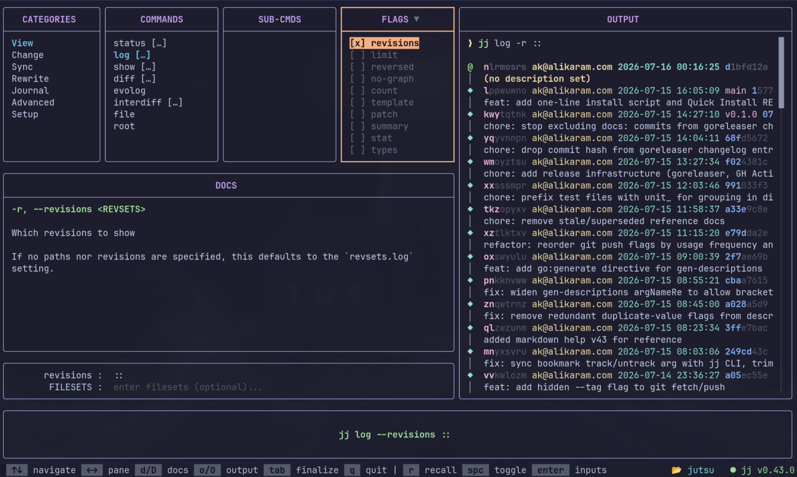

# 🥷 Jutsu — JJ TUI Command Composer

A sleek, modern Terminal User Interface for composing and executing Jujutsu (`jj`) commands. Built with go and the Charmbracelet ecosystem.




## 💭 Why Jutsu?

GUIs and TUIs are great, until they become a crutch — it happened to me
with VS Code, then again with Lazygit: the tool takes over and the
underlying commands fade from memory. Experienced developers always say
the same thing: learn the CLI, so you're never stranded without your
tools.

Jutsu is my answer for jj — built to teach you the commands as you use
them, so you get faster with it, but never dependent on it.

## ✨ Features

- 🧩 **Multi-pane command composer** with categories, commands, subcommands, and flags
- ⚡ **Live command preview** as you pick categories, subcommands, and flags
- 🔄 **Background execution** with live streaming output
- 📖 **Read jj's own docs** for any command or flag while navigating the composer
- ⌨️ **Vim-style navigation** (hjkl) plus arrow keys
- 🎨 **Catppuccin Mocha theme** with active/inactive panel highlighting
- 📐 **Responsive layout** that adapts to terminal size
- 📚 **Comprehensive jj command database** covering all major operations

## 📦 Installation

```bash
curl -fsSL https://raw.githubusercontent.com/AliQ80/jutsu/main/install.sh | sh
```

See [docs/installation.md](docs/installation.md) for prerequisites, alternative installation methods, and troubleshooting.

## Usage

Launch `jutsu`, navigate the panes with `hjkl` or arrows to compose your command, then `Tab` and `Enter` to run it. See [docs/usage.md](docs/usage.md) for the full keybinding reference.

## License

GPLv3 License — see LICENSE file for details

## Acknowledgments

- [Jujutsu VCS](https://jj-vcs.github.io/jj/) — The amazing version control system
- [Charmbracelet](https://charmbracelet.github.io/) — For the incredible TUI ecosystem
- [Catppuccin](https://catppuccin.com/) — For the beautiful color palette

---

**Built with ♥ using Go and Charmbracelet**
